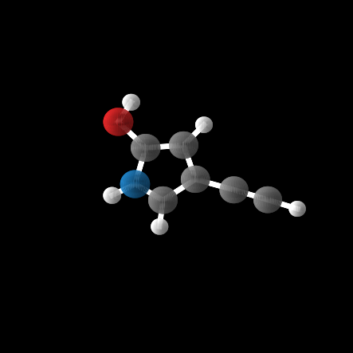

# Probai3: Diffusion Models for Molecule Generation 🧬

[](https://www.python.org/downloads/)
[](https://pytorch.org/)
[](https://opensource.org/licenses/MIT)

基于 **E(n) 等变扩散模型 (EDM)** 的分子生成项目，能够生成化学稳定的 3D 分子结构。

> 本项目基于 [Probai Summer School](https://github.com/vgsatorras/probai) 课程进行修改和扩展。

## ✨ 功能特点

- 🔬 **E(n) 等变性**：生成的分子结构在旋转和平移下保持不变
- 🧪 **化学稳定性**：自动评估生成分子的化学键有效性
- 📊 **3D 可视化**：支持分子结构的 3D 渲染
- 🎓 **教学友好**：包含完整的教程和练习

<div align=center>

</div>

## 🚀 快速开始

### 环境安装

```bash
# 克隆项目
git clone https://github.com/iSnolc/probai3.git
cd probai3

# 使用 conda 创建环境
conda env create -f environment.yaml
conda activate mol_diff

# 或使用 pip
pip install -r requirements.txt
```

### 数据准备

数据集托管在 Hugging Face:
- 原始数据: [yairschiff/qm9](https://huggingface.co/datasets/yairschiff/qm9)
- 处理后数据: [bird001/qm9-for-probai3](https://huggingface.co/datasets/bird001/qm9-for-probai3)

#### 1. 快速使用（预处理好的数据）
将下载的 `.pickle` 文件放入 `data/final_data/` 目录。

#### 2. 自定义处理（从原始 npz 开始）
使用内置工具处理原始数据：
```bash
cd scripts/data_preparation
python converters.py npz2pickle --input ../../data/raw/train.npz --output ../../data/final_data/train.pickle
```
更多详情请参阅 [数据预处理文档](scripts/data_preparation/README.md)。

### 训练与验证

```bash
# 完整训练
python scripts/train.py

# 快速测试 (Demo)
python scripts/demo_train.py

# 验证并评估
python scripts/valid.py

# Demo 验证
python scripts/demo_valid.py
```

## 📁 项目结构

```
probai3/
├── configs/                 # YAML 配置文件 (管理超参数)
├── data/                    # 数据目录 (原始与精简数据)
├── docs/                    # 项目详细文档
├── notebooks/               # Jupyter 学习教程
├── scripts/                 # 可执行脚本
│   ├── train.py             # 完整训练脚本
│   ├── valid.py             # 验证与评估脚本
│   ├── demo_*.py            # 示例/演示脚本
│   └── data_preparation/    # [REFACTORED] 数据预处理工具包
│       ├── converters.py    # 格式转换 (npz/csv/pickle)
│       ├── process_data.py  # 分子特征提取
│       └── clean_data.py    # 数据类型清洗
├── src/                     # 核心源代码
│   ├── data/               # Dataset 与 DataLoader 定义
│   ├── models/             # DDPM 扩散模型与 EGNN 网络
│   ├── training/           # 训练循环与逻辑
│   └── evaluation/         # 分子稳定性、可视化工具
├── tests/                   # 单元测试
├── environment.yaml         # 环境定义文件
└── README.md
```

## ⚙️ 配置说明

项目使用 YAML 文件管理参数。您可以修改 `configs/default.yaml` 来控制训练行为：

```yaml
EGNN:
  hidden_nf: 128    # 隐藏层维度
  n_layers: 3       # EGNN 层数
  equivariant: true

DDPM:
  N: 1000           # 扩散步数

Training:
  epochs: 10        # 训练轮数
  lr: 0.0005        # 学习率
  batch_size: 16    # 训练与验证的批次大小
```


## 🧠 模型架构

### DDPM (Denoising Diffusion Probabilistic Models)

```
前向过程 q(z_t | z_0):  z_0 → z_1 → ... → z_T (逐步加噪)
反向过程 p(z_{t-1} | z_t): z_T → z_{T-1} → ... → z_0 (逐步去噪)
```

### EGNN (E(n) Equivariant Graph Neural Networks)

用于预测噪声的评分网络，保证 E(n) 等变性：
- 输入: 带噪分子坐标 + 原子类型 + 时间步
- 输出: 预测的噪声

## 📊 评估指标

| 指标 | 说明 |
|------|------|
| 分子稳定性 | 生成分子中化学键有效的比例 |
| 原子稳定性 | 所有原子中化学键合理的比例 |

## 🧪 运行测试

```bash
# 运行所有测试
pytest tests/ -v

# 运行特定测试
pytest tests/test_ddpm.py -v
```

## 📚 参考资料

- [Equivariant Diffusion for Molecule Generation in 3D](https://arxiv.org/abs/2203.17003)
- [E(n) Equivariant Graph Neural Networks](https://arxiv.org/abs/2102.09844)
- [Denoising Diffusion Probabilistic Models](https://arxiv.org/abs/2006.11239)

## 🙏 致谢

- [vgsatorras/probai](https://github.com/vgsatorras/probai) - 原始课程代码
- [QM9 数据集](https://figshare.com/collections/Quantum_chemistry_structures_and_properties_of_134_kilo_molecules/978904)

## 📄 许可证

本项目采用 MIT 许可证。详见 [LICENSE](LICENSE) 文件。
